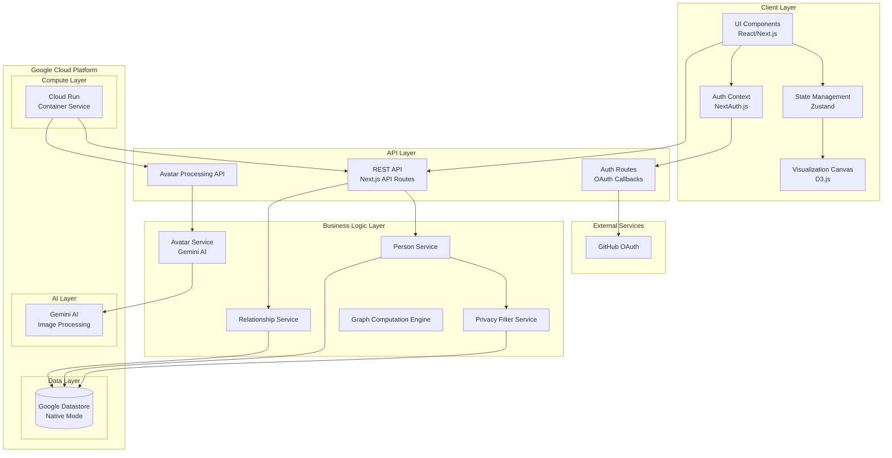
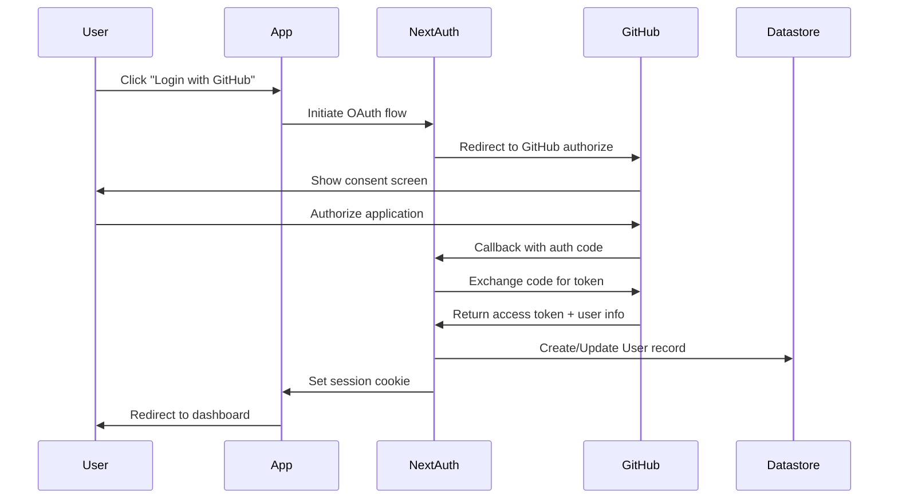
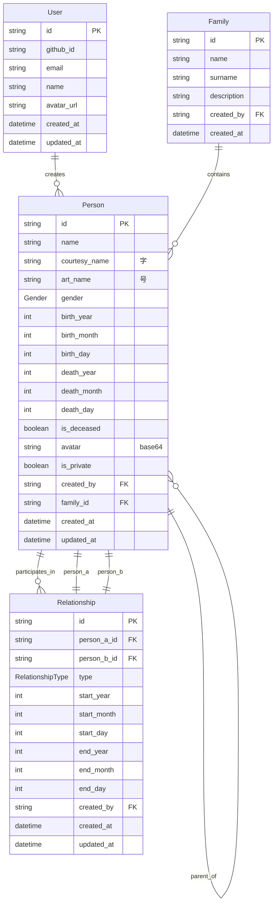
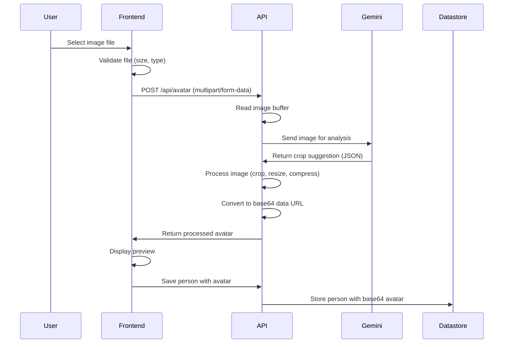

# Family Relationship Visualizer - Architecture & UI Specification

> **Version:** 1.0  
> **Document Type:** OpenSpec Technical Specification  
> **Target Application:** Complex Family Relationship Visualization  
> **Reference Domain:** "A Dream in Red Mansions" (红楼梦) Jia Family Tree  

---

## Table of Contents

1. [Executive Summary](#1-executive-summary)
2. [System Architecture Overview](#2-system-architecture-overview)
3. [Authentication & Authorization](#3-authentication--authorization)
4. [Data Model Schema](#4-data-model-schema)
5. [Avatar & Image Processing](#5-avatar--image-processing)
6. [Visualization Logic](#6-visualization-logic)
7. [Component Specifications](#7-component-specifications)
8. [UI/UX Design Guidelines](#8-uiux-design-guidelines)
9. [API Endpoints Design](#9-api-endpoints-design)
10. [Google Cloud Deployment](#10-google-cloud-deployment)
11. [Implementation Roadmap](#11-implementation-roadmap)
12. [Appendices](#12-appendices)

---

## 1. Executive Summary

### 1.1 Project Overview

The Family Relationship Visualizer is a sophisticated web application designed to model, visualize, and interact with complex family relationship structures. The system is specifically architected to handle the intricate relationships found in traditional Chinese noble families, such as the Jia family depicted in "A Dream in Red Mansions" (红楼梦).

### 1.2 Key Features

| Feature | Description |
|---------|-------------|
| **GitHub Authentication** | Secure login via GitHub OAuth 2.0 |
| **Privacy Controls** | Mark persons as private (visible only to creator) |
| **Relative Generation** | Generation numbers computed relative to selected person |
| **Centered Visualization** | Selected person displayed at center with 2 generations above and 3 below |
| **Gender-Specific Colors** | Blue gradient for males, Yellow/Gold gradient for females |
| **Precise Dates** | Optional month and day for birth/death and relationship dates |
| **Avatar Support** | Upload and display avatar images for each person |
| **Gemini Image Processing** | AI-powered smart cropping and compression for avatars |
| **Google Datastore** | Native Datastore for scalable, serverless data storage |
| **Cloud Run Deployment** | Containerized deployment on Google Cloud Run |

### 1.3 Key Design Principles

| Principle | Description |
|-----------|-------------|
| **Cultural Authenticity** | Accurate representation of traditional Chinese family structures |
| **Visual Clarity** | Intuitive distinction between relationship types and genders |
| **Privacy First** | User-controlled visibility of sensitive family information |
| **Scalability** | Serverless architecture supporting 1000+ family members |
| **Interactivity** | Rich exploration and editing capabilities |
| **Data Portability** | Import/Export in multiple formats |

---

## 2. System Architecture Overview

### 2.1 High-Level Architecture



### 2.2 Technology Stack

| Layer | Technology | Rationale |
|-------|------------|-----------|
| **Frontend Framework** | Next.js 15 (App Router) | SSR, API routes, excellent DX, Cloud Run compatible |
| **Authentication** | NextAuth.js v5 | GitHub OAuth, session management |
| **UI Components** | shadcn/ui + Radix UI | Accessible, customizable components |
| **Visualization** | D3.js v7 | Force-directed graphs, smooth animations |
| **State Management** | Zustand | Lightweight, TypeScript-friendly |
| **Styling** | Tailwind CSS + CSS Variables | Rapid prototyping, theming support |
| **Database** | Google Datastore (Native) | Serverless, scalable, hierarchical data |
| **ORM/Client** | @google-cloud/datastore | Official Node.js client |
| **AI Image Processing** | Google Gemini | Smart cropping, compression |
| **Container Runtime** | Docker + Cloud Run | Serverless containers, auto-scaling |
| **Validation** | Zod | Runtime type validation |

---

## 3. Authentication & Authorization

### 3.1 GitHub OAuth Integration

The application uses GitHub as the sole authentication provider for simplicity and developer-friendly user experience.



### 3.2 Authorization Rules

| Resource | Public | Authenticated User | Owner/Admin |
|----------|--------|-------------------|-------------|
| View public persons | ✅ | ✅ | ✅ |
| View private persons | ❌ | ❌ (only own) | ✅ |
| Create person | ❌ | ✅ | ✅ |
| Edit person | ❌ | ❌ (only own) | ✅ |
| Delete person | ❌ | ❌ (only own) | ✅ |
| Create relationship | ❌ | ✅ | ✅ |
| Edit relationship | ❌ | ❌ (only own) | ✅ |
| Upload avatar | ❌ | ✅ | ✅ |

---

## 4. Data Model Schema

### 4.1 Entity-Relationship Diagram



### 4.2 TypeScript Interface Definitions

```typescript
// Core Enums
export enum Gender {
  MALE = 'MALE',
  FEMALE = 'FEMALE',
  UNKNOWN = 'UNKNOWN'
}

export enum RelationshipType {
  PARENT_CHILD = 'PARENT_CHILD',
  SIBLING = 'SIBLING',
  HALF_SIBLING = 'HALF_SIBLING',
  SPOUSE = 'SPOUSE',
  CONCUBINE = 'CONCUBINE',
  BETROTHED = 'BETROTHED',
  ADOPTIVE_PARENT = 'ADOPTIVE_PARENT',
  FOSTER_PARENT = 'FOSTER_PARENT',
  SWORN_SIBLING = 'SWORN_SIBLING'
}

// Date components for precise date handling
export interface DateComponents {
  year?: number;
  month?: number;   // 1-12
  day?: number;     // 1-31
  isLunarCalendar?: boolean;
}

// Core Interfaces
export interface Person {
  id: string;
  name: string;
  courtesyName?: string;  // 字
  artName?: string;       // 号
  gender: Gender;
  
  // Precise birth date
  birthYear?: number | null;
  birthMonth?: number | null;
  birthDay?: number | null;
  
  // Precise death date
  deathYear?: number | null;
  deathMonth?: number | null;
  deathDay?: number | null;
  
  // Avatar - base64 encoded image
  avatar?: string | null;
  
  // Privacy control
  isPrivate: boolean;
  createdBy: string;
  
  familyId?: string;
  createdAt: Date;
  updatedAt: Date;
  
  // Computed field (relative to selected person)
  relativeGeneration?: number;
}

export interface Relationship {
  id: string;
  personAId: string;
  personBId: string;
  type: RelationshipType;
  
  // Precise start date
  startYear?: number | null;
  startMonth?: number | null;
  startDay?: number | null;
  
  // Precise end date
  endYear?: number | null;
  endMonth?: number | null;
  endDay?: number | null;
  
  createdBy: string;
  createdAt: Date;
  updatedAt: Date;
}

export interface User {
  id: string;
  githubId: string;
  email: string | null;
  name: string | null;
  avatarUrl: string | null;
}

export interface GenerationRange {
  ancestors: number;     // Generations above center (default: 2)
  descendants: number;   // Generations below center (default: 3)
}

export interface FilterState {
  genders: string[];
  relationshipTypes: string[];
  branchId: string | null;
  searchQuery: string;
  showPrivate: boolean;
}
```

---

## 5. Avatar & Image Processing

### 5.1 Overview

The avatar feature allows users to upload profile images for each person in the family tree. Images are processed using Google Gemini AI for smart cropping and compression before being stored as base64 encoded strings.

### 5.2 Architecture



### 5.3 Gemini AI Integration

```typescript
// Avatar processing API endpoint
// POST /api/avatar

interface AvatarUploadRequest {
  file: File;  // Image file (JPEG, PNG, GIF, WebP)
}

interface AvatarUploadResponse {
  success: boolean;
  avatar: string;  // Base64 data URL
  cropSuggestion: {
    x: number;      // 0-100 percentage
    y: number;      // 0-100 percentage
    width: number;  // 0-100 percentage
    height: number; // 0-100 percentage
  };
  originalSize: number;
  processedSize: number;
}

// Gemini VLM prompt for smart cropping
const GEMINI_CROP_PROMPT = `
You are an image analysis assistant. Analyze the provided image and return 
the best crop region for a square portrait avatar. Focus on the face/head area. 
Return ONLY a JSON object with x, y, width, height as percentages (0-100) of 
the image dimensions. Example: {"x": 20, "y": 10, "width": 60, "height": 60}
`;
```

### 5.4 Image Processing Flow

```typescript
// Avatar processing implementation
async function processAvatar(file: File): Promise<string> {
  // 1. Validate file
  const maxSize = 10 * 1024 * 1024; // 10MB
  const allowedTypes = ['image/jpeg', 'image/png', 'image/gif', 'image/webp'];
  
  if (file.size > maxSize) {
    throw new Error('File too large. Maximum size is 10MB.');
  }
  
  if (!allowedTypes.includes(file.type)) {
    throw new Error('Invalid file type.');
  }
  
  // 2. Read image buffer
  const buffer = await file.arrayBuffer();
  const base64Original = Buffer.from(buffer).toString('base64');
  
  // 3. Get smart crop suggestion from Gemini
  const cropSuggestion = await getSmartCropSuggestion(base64Original);
  
  // 4. Process image (in production, use Sharp library)
  // - Crop to suggested region
  // - Resize to 200x200 pixels
  // - Compress to WebP or optimized JPEG
  // - Convert to base64 data URL
  
  // 5. Return processed avatar
  return processedBase64;
}
```

### 5.5 Avatar Storage

Avatars are stored in the Person entity as a base64 encoded data URL:

```
data:image/jpeg;base64,/9j/4AAQSkZJRgABAQEA...
```

**Size Considerations:**
- Target avatar size: 200x200 pixels
- Expected base64 size: ~10-30KB per avatar
- Storage in Datastore: Part of Person entity
- Recommended: Implement CDN caching for production

### 5.6 Frontend Avatar Upload Component

```typescript
interface AvatarUploadProps {
  currentAvatar?: string | null;
  onUpload: (base64Avatar: string) => void;
  onRemove: () => void;
  isUploading: boolean;
}

// Features:
// - Click to upload
// - Drag and drop support
// - Preview with remove option
// - Loading state during Gemini processing
// - Error handling for file validation
```

---

## 6. Visualization Logic

### 6.1 Relative Generation Calculation

The system computes generation **relative to a selected "center person"**:

1. **Flexibility**: Works for any family tree structure
2. **Focus**: Always shows the selected person's context
3. **No Manual Input**: No need to define absolute generations

```typescript
export class GenerationCalculator {
  calculateRelativeGenerations(centerPersonId: string): Map<string, number> {
    const generations = new Map<string, number>();
    const queue = [{ personId: centerPersonId, generation: 0 }];
    
    while (queue.length > 0) {
      const { personId, generation } = queue.shift()!;
      generations.set(personId, generation);
      
      for (const rel of getRelationships(personId)) {
        const otherId = rel.personAId === personId ? rel.personBId : rel.personAId;
        let nextGen = generation;
        
        switch (rel.type) {
          case 'parent':
            // person1 is parent of person2
            nextGen = rel.personAId === personId ? generation + 1 : generation - 1;
            break;
          case 'spouse':
          case 'concubine':
            nextGen = generation; // Same generation
            break;
          // ... other relationship types
        }
        
        queue.push({ personId: otherId, generation: nextGen });
      }
    }
    
    return generations;
  }
}
```

### 6.2 Generation Display Range

| Generation Level | Description | Default Visibility |
|-----------------|-------------|-------------------|
| -2 | Great-grandparents | ✅ Visible |
| -1 | Grandparents | ✅ Visible |
| 0 | Center Person (selected) | ✅ Visible (highlighted) |
| +1 | Children | ✅ Visible |
| +2 | Grandchildren | ✅ Visible |
| +3 | Great-grandchildren | ✅ Visible |
| < -2 or > +3 | Outside range | ❌ Hidden (expandable) |

### 6.3 Avatar Display in Nodes

When a person has an avatar, the visualization shows:
- Background shape with gray fill
- Avatar image clipped to the shape
- Name label below the node
- Generation badge below name

```typescript
// Node rendering with avatar
function renderNode(node: GraphNode) {
  if (node.avatar) {
    // Draw background shape
    drawShape({ fill: '#f3f4f6', stroke: colors.stroke });
    
    // Clip and draw avatar
    addClipPath(`clip-${node.id}`);
    drawImage(node.avatar, { clipPath: `clip-${node.id}` });
    
    // Draw name below node
    drawText(node.name, { y: nodeSize + 14 });
  } else {
    // Draw colored shape without avatar
    drawShape({ fill: colors.fill, stroke: colors.stroke });
    
    // Draw name in center
    drawText(node.name, { y: 4 });
  }
}
```

---

## 7. Component Specifications

### 7.1 PersonForm with Avatar Upload

```typescript
interface PersonFormProps {
  isOpen: boolean;
  mode: 'create' | 'edit';
  person?: Person;
  currentUserId: string;
  onSubmit: (data: PersonFormData) => void;
  onClose: () => void;
}

interface PersonFormData {
  name: string;
  gender: Gender;
  
  // Precise dates
  birthYear?: number;
  birthMonth?: number;
  birthDay?: number;
  deathYear?: number;
  deathMonth?: number;
  deathDay?: number;
  
  // Avatar
  avatar?: string | null;
  
  // Privacy
  isPrivate: boolean;
  
  // Other fields
  alias?: string;
  notes?: string;
  branchId?: string;
}
```

**Form Layout:**

```
┌─────────────────────────────────────────────┐
│  Add New Person                        [X]  │
├─────────────────────────────────────────────┤
│                                             │
│  ┌────────┐                                │
│  │ Avatar │  [Upload Avatar]               │
│  │ Image  │  支持 JPEG, PNG, GIF, WebP     │
│  └────────┘  最大 10MB                     │
│                                             │
│  姓名 *                                     │
│  ┌──────────────────────────────────────┐  │
│  │                                      │  │
│  └──────────────────────────────────────┘  │
│                                             │
│  性别 *               隐私设置              │
│  ○ 男  ○ 女          □ 设为私密            │
│                                             │
│  出生日期 (可选年/月/日)                     │
│  ┌────────┐ ┌────────┐ ┌────────┐         │
│  │ 年     │ │ 月     │ │ 日     │         │
│  └────────┘ └────────┘ └────────┘         │
│                                             │
│  逝世日期 (可选年/月/日)                     │
│  ┌────────┐ ┌────────┐ ┌────────┐         │
│  │ 年     │ │ 月     │ │ 日     │         │
│  └────────┘ └────────┘ └────────┘         │
│                                             │
│           [取消]  [保存]                    │
└─────────────────────────────────────────────┘
```

### 7.2 FilterControls (Fixed)

```typescript
// FilterState no longer includes 'generations' field
// Generation filtering is controlled via generationRange

interface FilterState {
  genders: string[];
  relationshipTypes: string[];
  branchId: string | null;
  searchQuery: string;
  showPrivate: boolean;
}

interface GenerationRange {
  ancestors: number;     // 0-5
  descendants: number;   // 0-5
}
```

---

## 8. UI/UX Design Guidelines

### 8.1 Color Palette

```css
:root {
  /* Male Colors - Blue Gradient */
  --color-male-gen--2: #1E40AF;  /* Blue 800 */
  --color-male-gen--1: #1D4ED8;  /* Blue 700 */
  --color-male-gen-0: #2563EB;   /* Blue 600 */
  --color-male-gen-1: #3B82F6;   /* Blue 500 */
  --color-male-gen-2: #60A5FA;   /* Blue 400 */
  --color-male-gen-3: #93C5FD;   /* Blue 300 */
  
  /* Female Colors - Yellow/Gold Gradient */
  --color-female-gen--2: #F59E0B; /* Amber 500 */
  --color-female-gen--1: #FBBF24; /* Amber 400 */
  --color-female-gen-0: #FCD34D;  /* Amber 300 */
  --color-female-gen-1: #FDE68A;  /* Amber 200 */
  --color-female-gen-2: #FEF3C7;  /* Amber 100 */
  --color-female-gen-3: #FFFBEB;  /* Amber 50 */
  
  /* Center Person */
  --color-center-border: #BE123C; /* Rose 700 */
  
  /* Avatar Background */
  --color-avatar-bg: #f3f4f6;     /* Gray 100 */
}
```

### 8.2 Node Visual Design

```
With Avatar:              Without Avatar:
┌──────────┐             ┌──────────┐
│ [Avatar] │             │   Name   │
│  Image   │             │   文字   │
└──────────┘             └──────────┘
   Name                   
                          
Female (Yellow/Gold)     Male (Blue)
┌──────────┐             ┌──────────┐
│          │             │          │
│   Gold   │             │   Blue   │
│          │             │          │
└──────────┘             └──────────┘
 Rounded Rect            Rounded Rect
```

---

## 9. API Endpoints Design

### 9.1 RESTful API Structure

```yaml
# Authentication
GET    /api/auth/signin
GET    /api/auth/callback/github
POST   /api/auth/signout
GET    /api/auth/session

# Persons
GET    /api/persons
GET    /api/persons/:id
POST   /api/persons
PUT    /api/persons/:id
DELETE /api/persons/:id

# Relationships
GET    /api/relationships
GET    /api/relationships/:id
POST   /api/relationships
PUT    /api/relationships/:id
DELETE /api/relationships/:id

# Avatar Processing (NEW)
POST   /api/avatar
# Request: multipart/form-data with file
# Response: { success, avatar, cropSuggestion }

# Families
GET    /api/families
POST   /api/families

# Seed
POST   /api/seed
```

### 9.2 Avatar API Details

```typescript
// POST /api/avatar
// Content-Type: multipart/form-data

// Request
const formData = new FormData();
formData.append('file', imageFile);

// Response
{
  "success": true,
  "avatar": "data:image/jpeg;base64,/9j/4AAQ...",
  "cropSuggestion": {
    "x": 25,
    "y": 15,
    "width": 50,
    "height": 50
  },
  "originalSize": 2048576,
  "processedSize": 15324
}

// Error Response
{
  "error": "File too large. Maximum size is 10MB."
}
```

---

## 10. Google Cloud Deployment

### 10.1 Deployment Configuration

```yaml
# cloud-run.yaml
apiVersion: serving.knative.dev/v1
kind: Service
metadata:
  name: family-relationship-visualizer
spec:
  template:
    spec:
      containers:
      - image: gcr.io/PROJECT_ID/family-visualizer:latest
        ports:
        - containerPort: 3000
        env:
        - name: NEXTAUTH_URL
          value: https://YOUR_DOMAIN
        - name: NEXTAUTH_SECRET
          valueFrom:
            secretKeyRef:
              name: nextauth-secret
              key: secret
        - name: GITHUB_CLIENT_ID
          valueFrom:
            secretKeyRef:
              name: github-oauth
              key: client-id
        - name: GITHUB_CLIENT_SECRET
          valueFrom:
            secretKeyRef:
              name: github-oauth
              key: client-secret
        - name: GOOGLE_CLOUD_PROJECT
          value: PROJECT_ID
        # Gemini API for avatar processing
        - name: GOOGLE_AI_API_KEY
          valueFrom:
            secretKeyRef:
              name: google-ai
              key: api-key
        resources:
          limits:
            memory: "1Gi"
            cpu: "1"
```

### 10.2 Required Secrets

```bash
# Create secrets in Google Secret Manager

# NextAuth secret
echo -n "your-secret" | gcloud secrets create nextauth-secret --data-file=-

# GitHub OAuth
echo -n "your-client-id" | gcloud secrets create github-oauth --data-file=-
echo -n "your-client-secret" | gcloud secrets versions add github-oauth --data-file=-

# Google AI (Gemini) API key
echo -n "your-gemini-api-key" | gcloud secrets create google-ai --data-file=-
```

---

## 11. Implementation Roadmap

### Phase 1: Core Features (Completed)
- ✅ GitHub Authentication
- ✅ Privacy controls
- ✅ Relative generation calculation
- ✅ Centered visualization
- ✅ Yellow/blue color scheme

### Phase 2: Avatar Feature (Current)
- ✅ Add avatar field to Person model
- ✅ Create avatar upload API with Gemini
- ✅ Implement avatar display in canvas
- ✅ Update PersonForm with avatar upload

### Phase 3: Production Deployment
- [ ] Configure Google Cloud project
- [ ] Set up Secret Manager
- [ ] Deploy to Cloud Run
- [ ] Configure custom domain
- [ ] Set up monitoring

---

## 12. Appendices

### 12.1 Environment Variables

```bash
# .env.local (Development)
NEXTAUTH_URL=http://localhost:3000
NEXTAUTH_SECRET=your-secret-key

# GitHub OAuth
GITHUB_CLIENT_ID=your-github-client-id
GITHUB_CLIENT_SECRET=your-github-client-secret

# Google Cloud
GOOGLE_CLOUD_PROJECT=your-project-id
GOOGLE_APPLICATION_CREDENTIALS=/path/to/service-account.json

# Google AI (Gemini)
GOOGLE_AI_API_KEY=your-gemini-api-key

# Production (Cloud Run)
# Set via Cloud Run environment variables and Secret Manager
```

### 12.2 File Structure

```
/home/z/my-project/
├── src/
│   ├── app/
│   │   ├── api/
│   │   │   ├── auth/[...nextauth]/
│   │   │   ├── avatar/           # NEW
│   │   │   │   └── route.ts
│   │   │   ├── persons/
│   │   │   └── relationships/
│   ├── components/
│   │   ├── FamilyTreeCanvas.tsx  # Updated for avatars
│   │   ├── PersonForm.tsx        # Updated for avatars
│   │   ├── FilterControls.tsx    # Fixed generations bug
│   │   └── ...
│   ├── lib/
│   │   ├── generation-calculator.ts
│   │   └── auth.ts
│   └── types/
│       └── index.ts              # Includes avatar field
├── prisma/
│   └── schema.prisma             # Includes avatar field
└── Dockerfile
```
